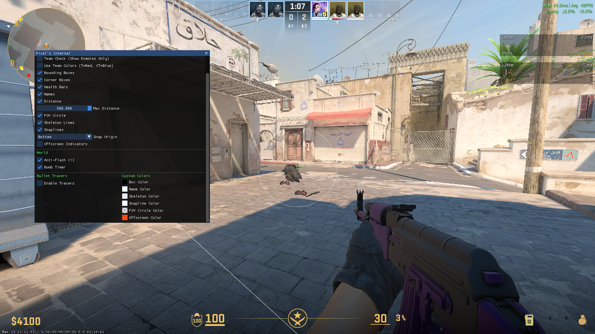
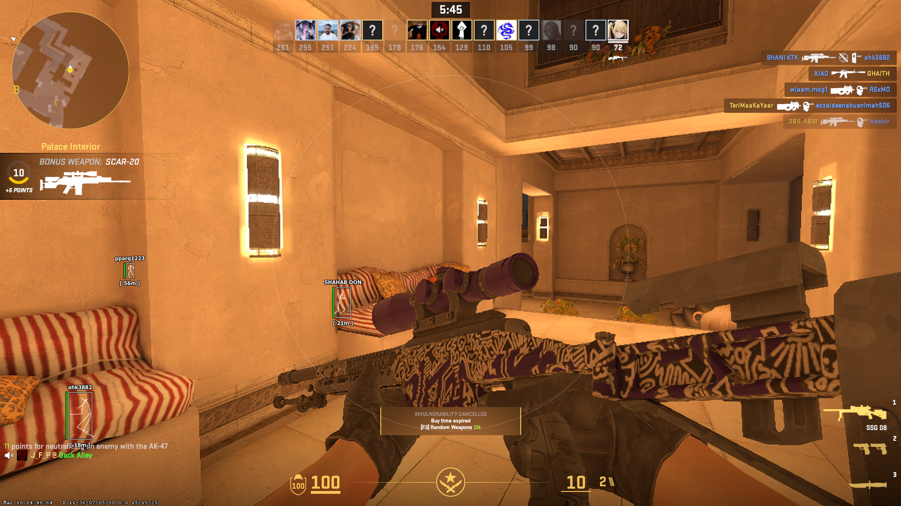

# Pixel's CS2 Internal Cheat

A powerful internal cheat for Counter-Strike 2. This repo has the full source code and everything you need to build it yourself.

> Check me out! Be sure to visit my personal website at https://pixelis.dev/ for more projects and tools.

> [!IMPORTANT]
> **Offsets are up to date as of: 25/3/2026**

## Features

Pixel's Internal is fast and built to stay hidden. Since it's an internal cheat, it's way smoother than external ones.

### Aimbot & RCS
- **Aimbot**: Custom aim with team check and wall check.
- **Smooth Aim**: Human-like aiming so you don't look like a bot.
- **RCS**: Recoil control to keep your shots on target.
- **Triggerbot**: Shoots automatically when someone walks into your crosshair.

### Visuals (ESP)
- **Player ESP**: See boxes, skeletons, and lines for all players.
- **Extra Info**: Track health, names, and how far away enemies are.
- **World ESP**: See the bomb timer and where your bullets are hitting.
- **Anti-Flash**: Don't get blinded by flashbangs.

### Skin Changer
- **Change Skins**: Pick any skin for your guns while in-game.
- **StatTrak**: Add kill counters to your skins.

## Roadmap to v2

I am already working on the next major update! **Pixel CS2 Internal v2** will include:

- [ ] **Reliable Visibility Check**: No more aiming through walls. Uses `bSpottedByMask` for a truly legit experience.
- [ ] **Spectator List**: See exactly who is watching you in real-time.
- [ ] **Hit Sound**: Crunchy audio feedback for every shot landed.
- [ ] **Glow ESP**: High-performance glowing outlines for maximum visibility.
- [ ] **External Radar**: A separate map overlay for better awareness.
- [ ] **Bhop**: Automatic bunnyhopping for faster movement.

> [!TIP]
> **Pixel CS2 Internal v2** will be released to the public once this repository reaches **40 Stars**! ⭐ Help us get there!

## Staying Safe

Standard injectors like **Xenos** or **Extreme Injector** can be detected if you're not careful. 

To stay undetected with this cheat, you **must** use these settings:
1. **Stealth Inject**: Hides the cheat from basic scans.
2. **Erase PE Headers**: Wipes the cheat's footprint from memory after it loads.

### Best Settings

## Build & Setup

1. **Get Visual Studio**: Install VS 2022 with C++ desktop development.
2. **Open Project**: Go to `Pixel-Cs2-internal` and open `Pixel's CS2 Internal.slnx`.
3. **Update Offsets**: Put your fresh offsets in the `Cs2-Offsets` folder.
4. **Build**: Set to **Release | x64** and build the solution. Your DLL will be in `x64/Release/`.

## How to use

If you don't want to build it, there is a prebuilt DLL in the `releases/` folder.  
**Note:** This DLL may be outdated if you are viewing this repo late. I probably won't update the offsets for every single game update. If the cheat doesn't work, just rebuild the source code himself using the latest offsets from the dumper linked below.

1. Open CS2.
2. Run your injector as Admin.
3. **Copy the config from the screenshot above** for Extreme Injector or any major injector. 
4. **Manual Map** is important! Make sure your injector is set to use it.
5. Inject and press **INSERT** for the menu.

---

*This project is for educational use and research. Use it at your own risk; I'm not responsible for any bans.*

Check out more at [pixelis.dev](https://pixelis.dev/)
